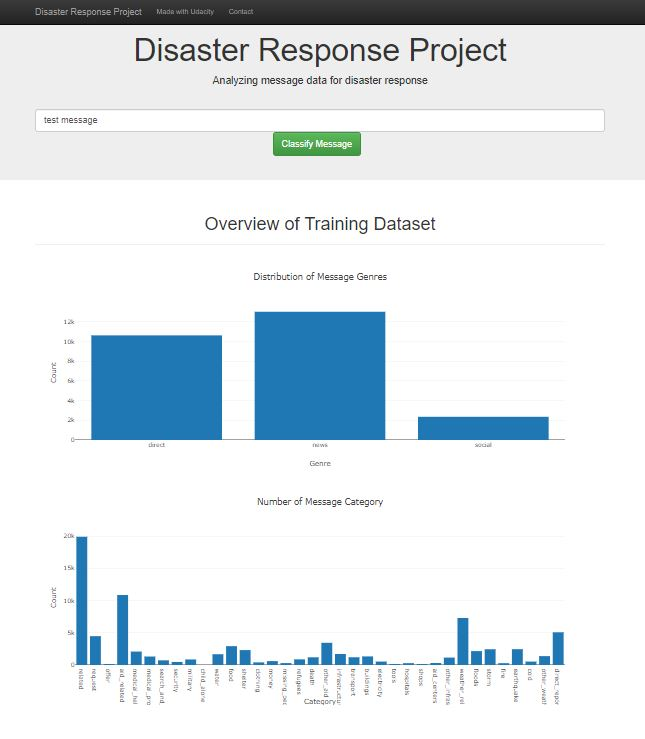

# Disaster Response Pipeline Project

## Table of Contents
 * [Project Motivation](#project-motivation)
 * [File Description](#file-description)
 * [Components](#components)
 * [Run project](#run-project)
 * [Licensing, Authors, Acknowledgements, etc.](#licensing-authors-acknowledgements-etc)

 ### Project Motivation

 In this project, I used my data engineering skills to preprocess data and build machine learning model to predict category of a message about disaster. The project includes:
  - ETL Pipeline that preprocess, clean and save data
  - Machine Learning Pipeline  that preprocess, transform data and train machine learning model to predict category of a message
  - Web application for user can use model directly by entering message, model will predict and show result
 
  ### File Description
```
└── app
    ├── templates # contain html file to show ui
    └── run.py # python script that run flask web server
└── data
    ├── disaster_categories.csv # dataset contain label category of a message
    ├── disaster_messages.csv # dataset contain content of the message
    └── process_data.py # python script that process data and save into database

└── models
    └── train_classifier.py # build and train ML model
```
  ### Components

  #### 1. ETL Pipeline
  A python script, 'process_data.py' in data folder preprocess and clean data:
  - Load and merge data from 2 different source
  - Extract all category of messages
  - Clean data by removing duplicate samples
  - Save data to database

  #### 2. Machine Learning Pipeline
  A python script, 'train_classifier.py', transform data into numeric data that can used in machine learning model and train classifier model:
  - Load data from database
  - Split data into train dataset and test dataset
  - Build machine learning pipeline to transform and predict data
  - Train model and search hyperparameters
  - Export model to pickle file
  #### 3. Flask App
  Flask web appication that show some statistc about disaster dataset and enable user to enter a message then get result about category of that message

  

  

  ### Run project
  1. Run the following commands in the project's root directory to set up your database and model.

    - To run ETL pipeline that cleans data and stores in database
        `python data/process_data.py data/disaster_messages.csv data/disaster_categories.csv data/DisasterResponse.db`
    - To run ML pipeline that trains classifier and saves
        `python models/train_classifier.py data/DisasterResponse.db models/classifier.pkl`

  2. Go to `app` directory: `cd app`

  3. Run your web app: `python run.py`

  4. Go to http://localhost:3000

### Licensing, Authors, Acknowledgements, etc.
Thanks to Udacity for starter code for the web app. 